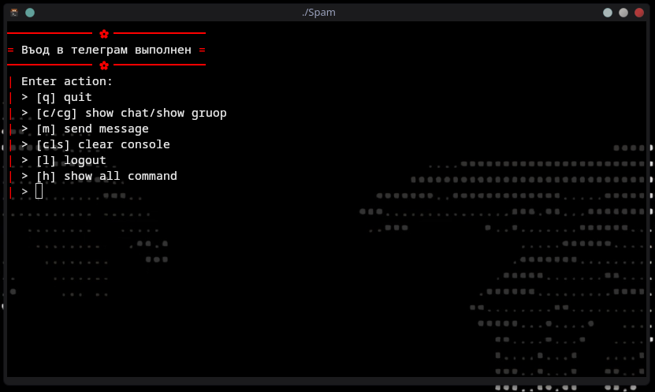
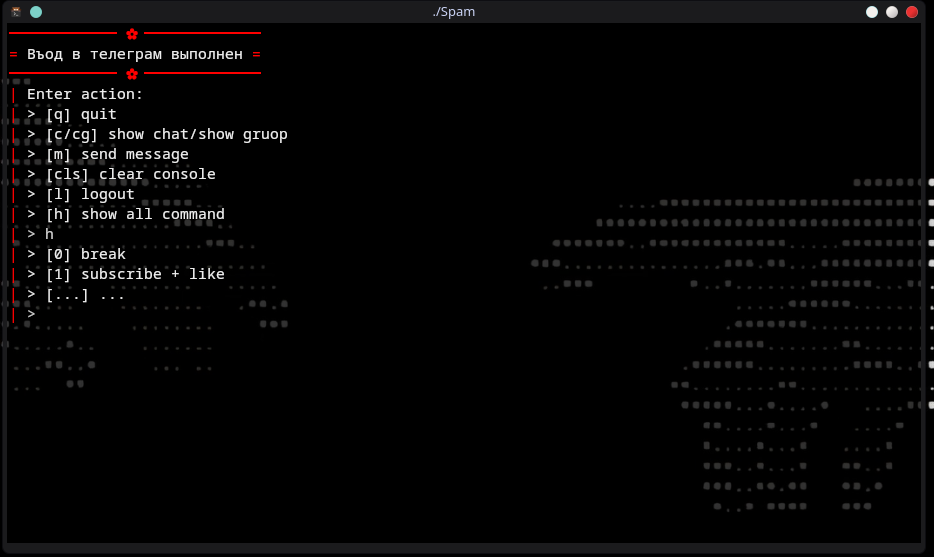
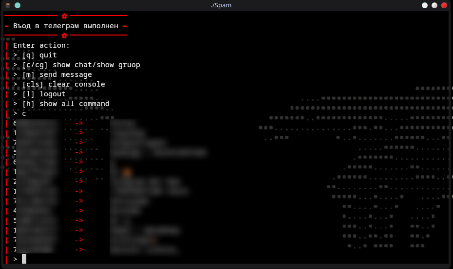

<div align="center">

<h1>😈Spam v1.5😈</h1><p><em>Telegram Spam</em></p>

</div>

---

## Project Purpose

**Spam** A C++ script for automated messaging and engagement in Telegram groups and private chats: 

- **Group Messaging**: Automatically sends messages to all Telegram groups you're a member of
- **Auto-Reply**: Automatically responds to private messages with customizable responses
- **Mutual Subscriptions**: Handles mutual subscriptions and follows
- **Smart Engagement**: Intelligent interaction with users who message you first

---

>[!WARNING]
> ⚠️
> Warning: Use at your own risk!
> - Always use throwaway or temporary Telegram accounts
> - Multiple rapid contact additions may trigger Telegram's anti-spam systems
> - Accounts may face temporary or permanent restriction
> - Recommended to use with proxies for better safety

---

## Screenshots





---

## Dependencies Installation
> Linux:
### 3. Install TDlib
```bash
Follow the instructions strictly!!
Download TDLib -> https://tdlib.github.io/td/build.html
> C++
> Linux
> Your distro - Choose what you have
+ Enable Link Time Optimization (requires CMake >= 3.9.0)...
+ Install built TDLib to /usr/local instead of placing the files to td/tdlib.

- Next, choose what you have
```
### 2. Install Project:
```bash
git clone https://github.com/Tabyretkadp/Spam.git
cd Spam
```
### 4. Make:
```bash
mkdir build
cd build
cmake ..
make
```
